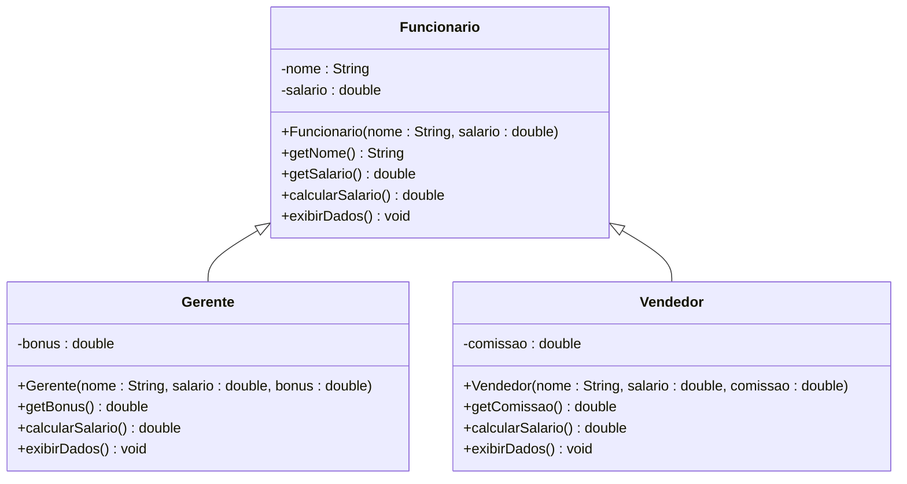

# Atividade 1 — Sistema de Funcionários: Diagrama UML de classes

```mermaid
classDiagram
    class Funcionario {
        -nome : String
        -salario : double
        +Funcionario(nome : String, salario : double)
        +getNome() String
        +getSalario() double
        +calcularSalario() double
        +exibirDados() void
    }
    class Gerente {
        -bonus : double
        +Gerente(nome : String, salario : double, bonus : double)
        +getBonus() double
        +calcularSalario() double
        +exibirDados() void
    }
    class Vendedor {
        -comissao : double
        +Vendedor(nome : String, salario : double, comissao : double)
        +getComissao() double
        +calcularSalario() double
        +exibirDados() void
    }
    Funcionario <|-- Gerente
    Funcionario <|-- Vendedor
```
