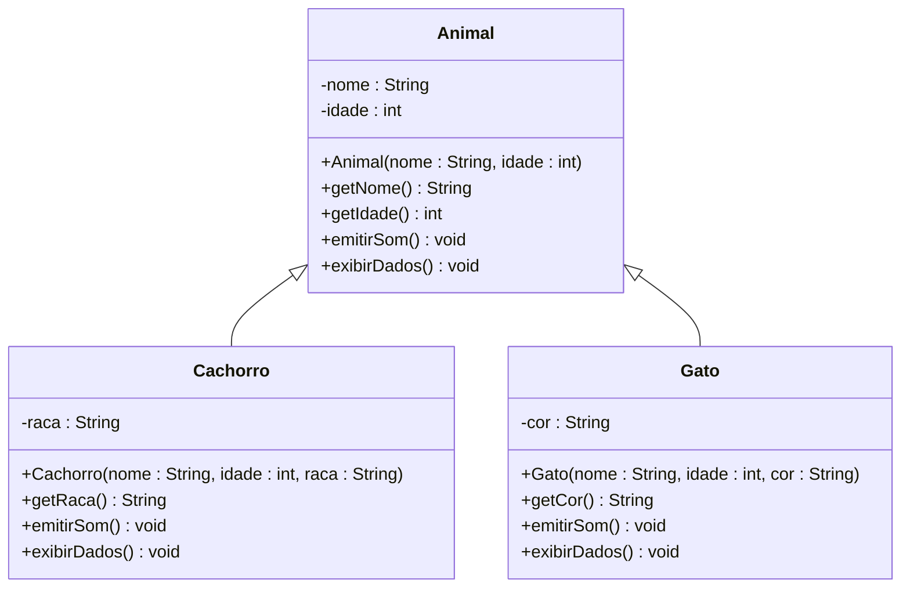

# Atividade 2 — Sistema de Animais: Diagrama UML de classes

```mermaid
classDiagram
    class Animal {
        -nome : String
        -idade : int
        +Animal(nome : String, idade : int)
        +getNome() String
        +getIdade() int
        +emitirSom() void
        +exibirDados() void
    }
    class Cachorro {
        -raca : String
        +Cachorro(nome : String, idade : int, raca : String)
        +getRaca() String
        +emitirSom() void
        +exibirDados() void
    }
    class Gato {
        -cor : String
        +Gato(nome : String, idade : int, cor : String)
        +getCor() String
        +emitirSom() void
        +exibirDados() void
    }
    Animal <|-- Cachorro
    Animal <|-- Gato
```
