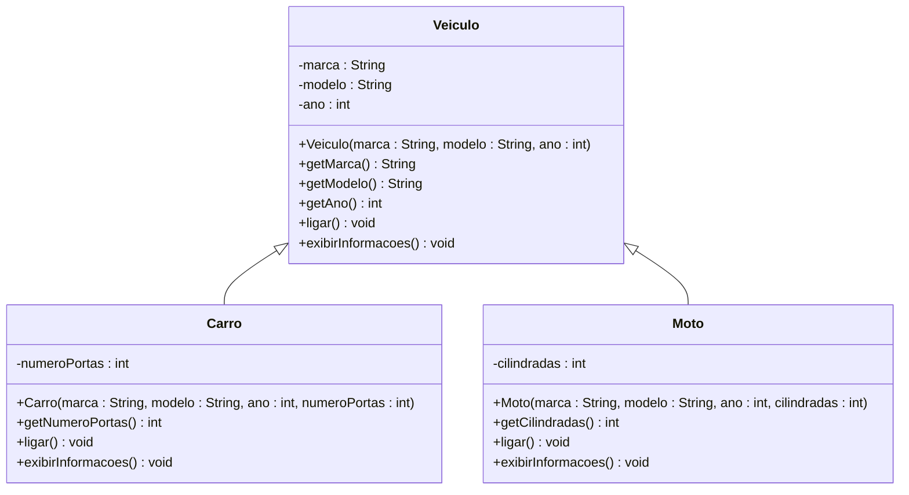

# Atividade 3 — Sistema de Veículos: Diagrama UML de classes

```mermaid
classDiagram
    class Veiculo {
        -marca : String
        -modelo : String
        -ano : int
        +Veiculo(marca : String, modelo : String, ano : int)
        +getMarca() String
        +getModelo() String
        +getAno() int
        +ligar() void
        +exibirInformacoes() void
    }
    class Carro {
        -numeroPortas : int
        +Carro(marca : String, modelo : String, ano : int, numeroPortas : int)
        +getNumeroPortas() int
        +ligar() void
        +exibirInformacoes() void
    }
    class Moto {
        -cilindradas : int
        +Moto(marca : String, modelo : String, ano : int, cilindradas : int)
        +getCilindradas() int
        +ligar() void
        +exibirInformacoes() void
    }
    Veiculo <|-- Carro
    Veiculo <|-- Moto
```
