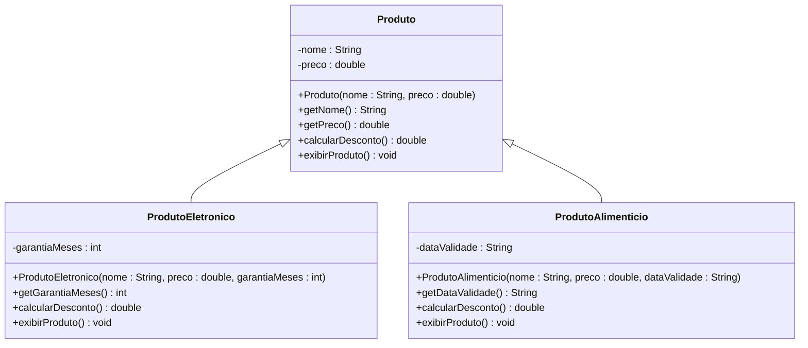

# Atividade 4 — Sistema de Produtos: Diagrama UML de classes

```mermaid
classDiagram
    class Produto {
        -nome : String
        -preco : double
        +Produto(nome : String, preco : double)
        +getNome() String
        +getPreco() double
        +calcularDesconto() double
        +exibirProduto() void
    }
    class ProdutoEletronico {
        -garantiaMeses : int
        +ProdutoEletronico(nome : String, preco : double, garantiaMeses : int)
        +getGarantiaMeses() int
        +calcularDesconto() double
        +exibirProduto() void
    }
    class ProdutoAlimenticio {
        -dataValidade : String
        +ProdutoAlimenticio(nome : String, preco : double, dataValidade : String)
        +getDataValidade() String
        +calcularDesconto() double
        +exibirProduto() void
    }
    Produto <|-- ProdutoEletronico
    Produto <|-- ProdutoAlimenticio
```
