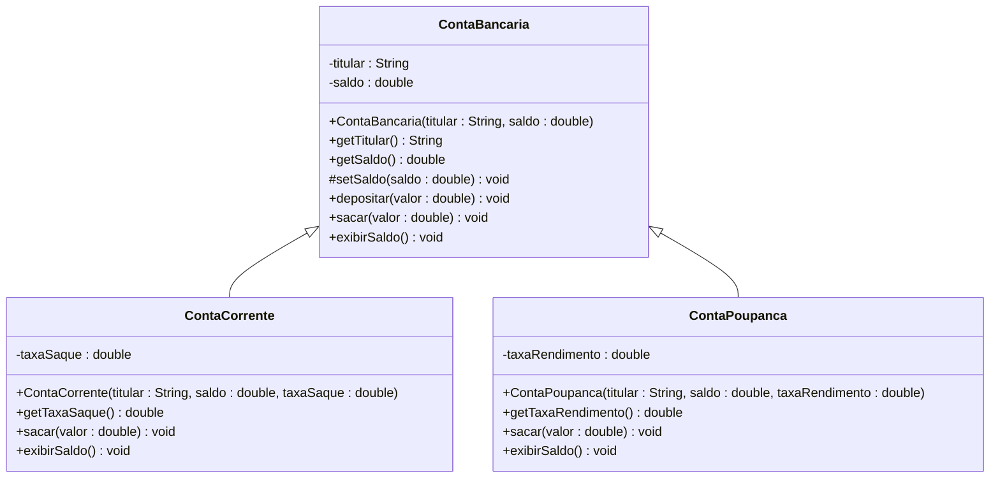

# Atividade 5 — Sistema Bancário: Diagrama UML de classes

```mermaid
classDiagram
    class ContaBancaria {
        -titular : String
        -saldo : double
        +ContaBancaria(titular : String, saldo : double)
        +getTitular() String
        +getSaldo() double
        #setSaldo(saldo : double) void
        +depositar(valor : double) void
        +sacar(valor : double) void
        +exibirSaldo() void
    }
    class ContaCorrente {
        -taxaSaque : double
        +ContaCorrente(titular : String, saldo : double, taxaSaque : double)
        +getTaxaSaque() double
        +sacar(valor : double) void
        +exibirSaldo() void
    }
    class ContaPoupanca {
        -taxaRendimento : double
        +ContaPoupanca(titular : String, saldo : double, taxaRendimento : double)
        +getTaxaRendimento() double
        +sacar(valor : double) void
        +exibirSaldo() void
    }
    ContaBancaria <|-- ContaCorrente
    ContaBancaria <|-- ContaPoupanca
```
