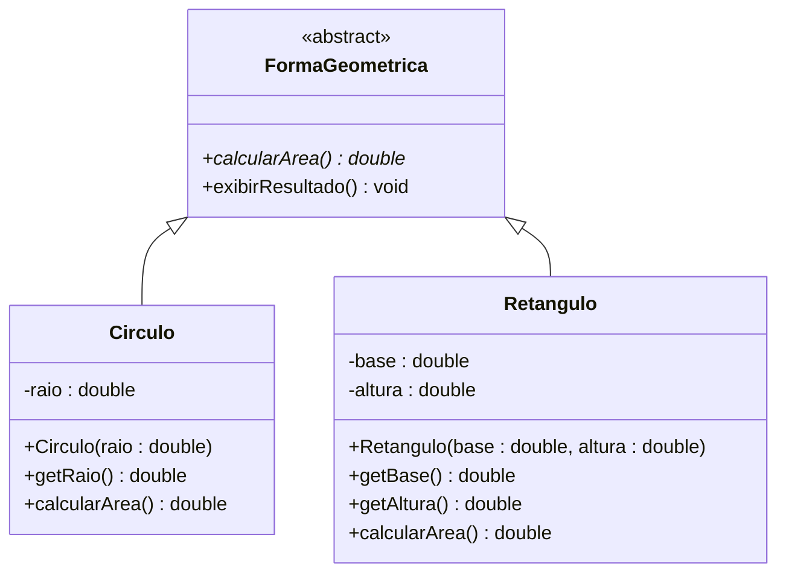

# Atividade 6 — Sistema de Formas Geométricas: Diagrama UML de classes

```mermaid
classDiagram
    class FormaGeometrica {
        <<abstract>>
        +calcularArea()* double
        +exibirResultado() void
    }
    class Circulo {
        -raio : double
        +Circulo(raio : double)
        +getRaio() double
        +calcularArea() double
    }
    class Retangulo {
        -base : double
        -altura : double
        +Retangulo(base : double, altura : double)
        +getBase() double
        +getAltura() double
        +calcularArea() double
    }
    FormaGeometrica <|-- Circulo
    FormaGeometrica <|-- Retangulo
```
