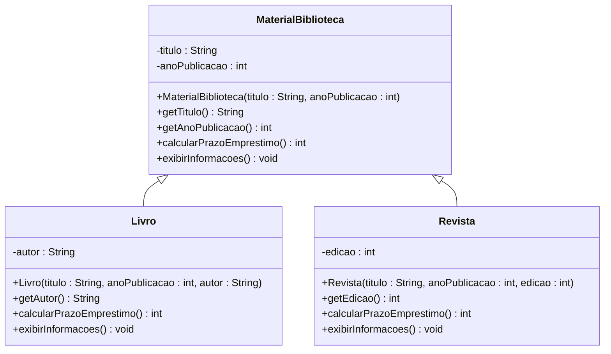

# Atividade 7 — Sistema de Biblioteca: Diagrama UML de classes

```mermaid
classDiagram
    class MaterialBiblioteca {
        -titulo : String
        -anoPublicacao : int
        +MaterialBiblioteca(titulo : String, anoPublicacao : int)
        +getTitulo() String
        +getAnoPublicacao() int
        +calcularPrazoEmprestimo() int
        +exibirInformacoes() void
    }
    class Livro {
        -autor : String
        +Livro(titulo : String, anoPublicacao : int, autor : String)
        +getAutor() String
        +calcularPrazoEmprestimo() int
        +exibirInformacoes() void
    }
    class Revista {
        -edicao : int
        +Revista(titulo : String, anoPublicacao : int, edicao : int)
        +getEdicao() int
        +calcularPrazoEmprestimo() int
        +exibirInformacoes() void
    }
    MaterialBiblioteca <|-- Livro
    MaterialBiblioteca <|-- Revista
```
