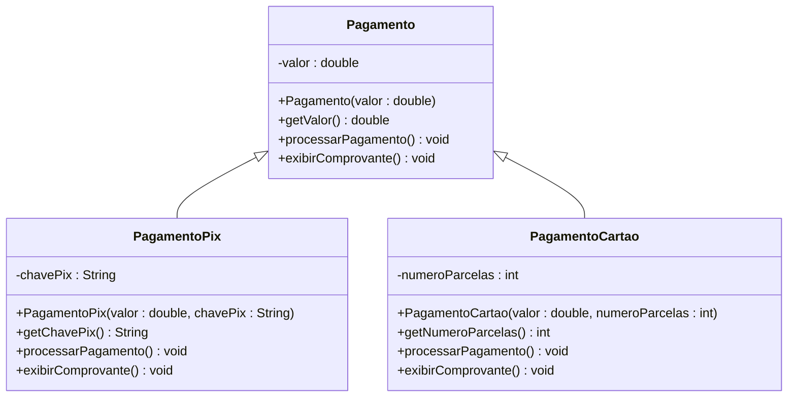

# Atividade 8 — Sistema de Pagamentos: Diagrama UML de classes

```mermaid
classDiagram
    class Pagamento {
        -valor : double
        +Pagamento(valor : double)
        +getValor() double
        +processarPagamento() void
        +exibirComprovante() void
    }
    class PagamentoPix {
        -chavePix : String
        +PagamentoPix(valor : double, chavePix : String)
        +getChavePix() String
        +processarPagamento() void
        +exibirComprovante() void
    }
    class PagamentoCartao {
        -numeroParcelas : int
        +PagamentoCartao(valor : double, numeroParcelas : int)
        +getNumeroParcelas() int
        +processarPagamento() void
        +exibirComprovante() void
    }
    Pagamento <|-- PagamentoPix
    Pagamento <|-- PagamentoCartao
```
