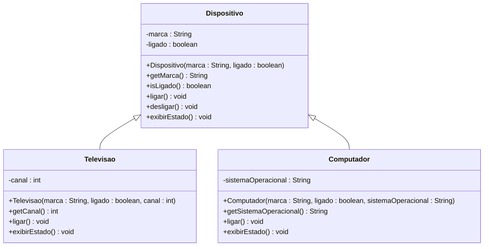

# Atividade 9 — Sistema de Dispositivos Eletrônicos: Diagrama UML de classes

```mermaid
classDiagram
    class Dispositivo {
        -marca : String
        -ligado : boolean
        +Dispositivo(marca : String, ligado : boolean)
        +getMarca() String
        +isLigado() boolean
        +ligar() void
        +desligar() void
        +exibirEstado() void
    }
    class Televisao {
        -canal : int
        +Televisao(marca : String, ligado : boolean, canal : int)
        +getCanal() int
        +ligar() void
        +exibirEstado() void
    }
    class Computador {
        -sistemaOperacional : String
        +Computador(marca : String, ligado : boolean, sistemaOperacional : String)
        +getSistemaOperacional() String
        +ligar() void
        +exibirEstado() void
    }
    Dispositivo <|-- Televisao
    Dispositivo <|-- Computador
```
