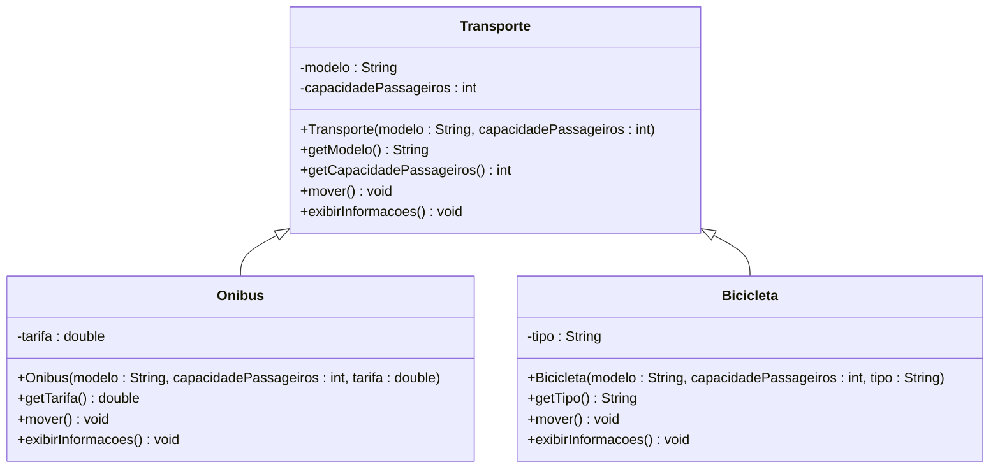

# Atividade 10 — Sistema de Transporte: Diagrama UML de classes

```mermaid
classDiagram
    class Transporte {
        -modelo : String
        -capacidadePassageiros : int
        +Transporte(modelo : String, capacidadePassageiros : int)
        +getModelo() String
        +getCapacidadePassageiros() int
        +mover() void
        +exibirInformacoes() void
    }
    class Onibus {
        -tarifa : double
        +Onibus(modelo : String, capacidadePassageiros : int, tarifa : double)
        +getTarifa() double
        +mover() void
        +exibirInformacoes() void
    }
    class Bicicleta {
        -tipo : String
        +Bicicleta(modelo : String, capacidadePassageiros : int, tipo : String)
        +getTipo() String
        +mover() void
        +exibirInformacoes() void
    }
    Transporte <|-- Onibus
    Transporte <|-- Bicicleta
```
