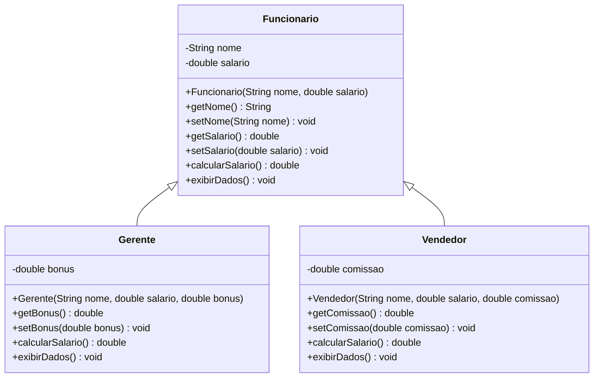

# Diagrama de Classes UML — Atividade 1 (Sistema de Funcionários)

```mermaid
classDiagram
    class Funcionario {
        -String nome
        -double salario
        +Funcionario(String nome, double salario)
        +getNome() String
        +setNome(String nome) void
        +getSalario() double
        +setSalario(double salario) void
        +calcularSalario() double
        +exibirDados() void
    }

    class Gerente {
        -double bonus
        +Gerente(String nome, double salario, double bonus)
        +getBonus() double
        +setBonus(double bonus) void
        +calcularSalario() double
        +exibirDados() void
    }

    class Vendedor {
        -double comissao
        +Vendedor(String nome, double salario, double comissao)
        +getComissao() double
        +setComissao(double comissao) void
        +calcularSalario() double
        +exibirDados() void
    }

    Funcionario <|-- Gerente
    Funcionario <|-- Vendedor
```
