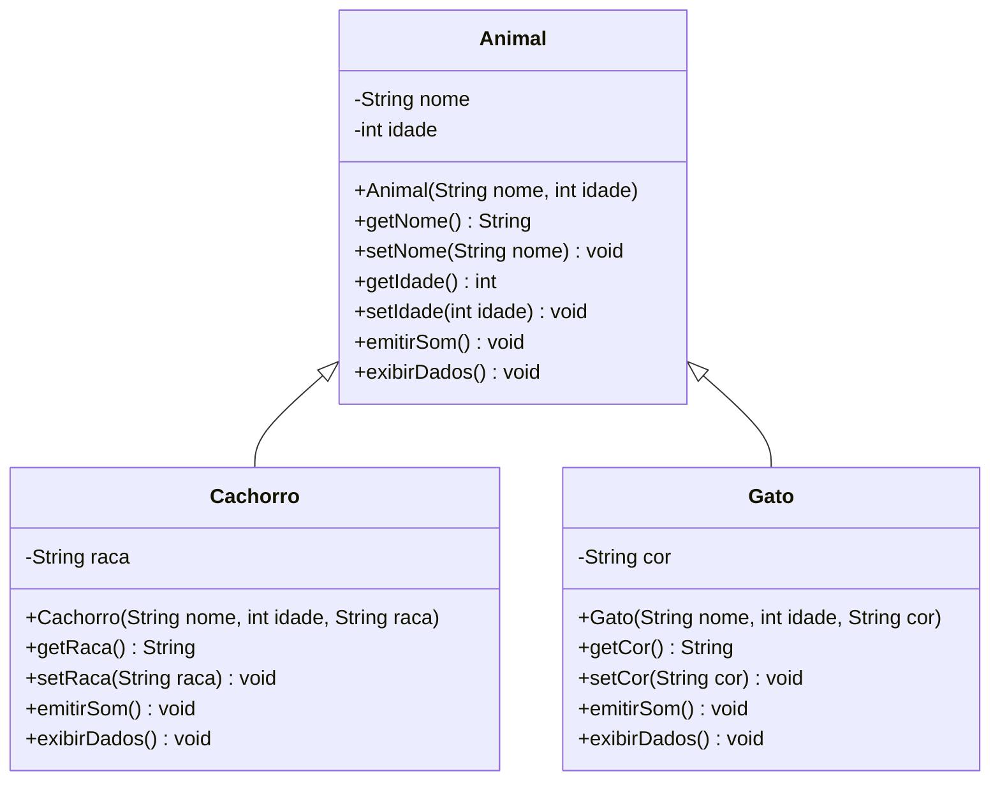

# Diagrama de Classes UML — Atividade 2 (Sistema de Animais)

```mermaid
classDiagram
    class Animal {
        -String nome
        -int idade
        +Animal(String nome, int idade)
        +getNome() String
        +setNome(String nome) void
        +getIdade() int
        +setIdade(int idade) void
        +emitirSom() void
        +exibirDados() void
    }

    class Cachorro {
        -String raca
        +Cachorro(String nome, int idade, String raca)
        +getRaca() String
        +setRaca(String raca) void
        +emitirSom() void
        +exibirDados() void
    }

    class Gato {
        -String cor
        +Gato(String nome, int idade, String cor)
        +getCor() String
        +setCor(String cor) void
        +emitirSom() void
        +exibirDados() void
    }

    Animal <|-- Cachorro
    Animal <|-- Gato
```
