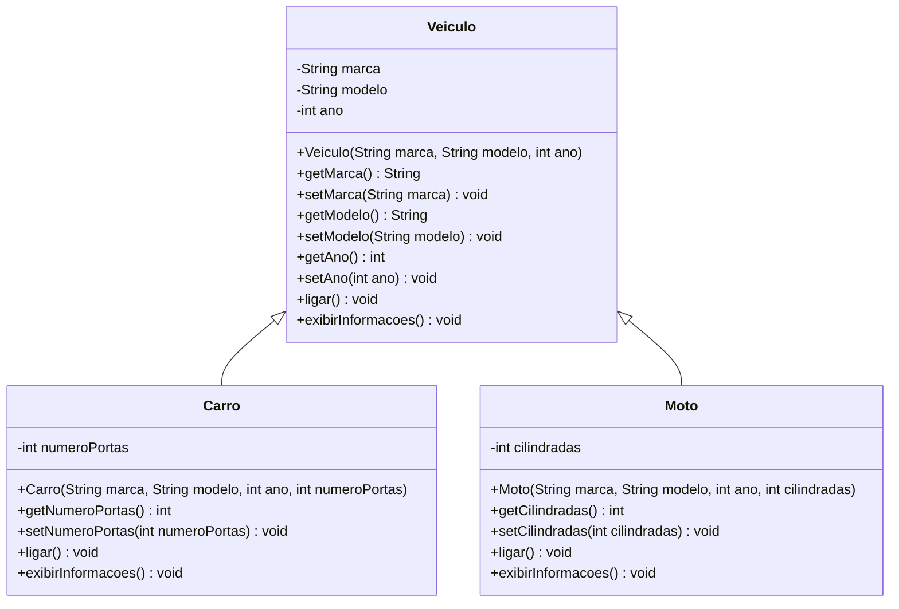

# Diagrama de Classes UML — Atividade 3 (Sistema de Veículos)

```mermaid
classDiagram
    class Veiculo {
        -String marca
        -String modelo
        -int ano
        +Veiculo(String marca, String modelo, int ano)
        +getMarca() String
        +setMarca(String marca) void
        +getModelo() String
        +setModelo(String modelo) void
        +getAno() int
        +setAno(int ano) void
        +ligar() void
        +exibirInformacoes() void
    }

    class Carro {
        -int numeroPortas
        +Carro(String marca, String modelo, int ano, int numeroPortas)
        +getNumeroPortas() int
        +setNumeroPortas(int numeroPortas) void
        +ligar() void
        +exibirInformacoes() void
    }

    class Moto {
        -int cilindradas
        +Moto(String marca, String modelo, int ano, int cilindradas)
        +getCilindradas() int
        +setCilindradas(int cilindradas) void
        +ligar() void
        +exibirInformacoes() void
    }

    Veiculo <|-- Carro
    Veiculo <|-- Moto
```
