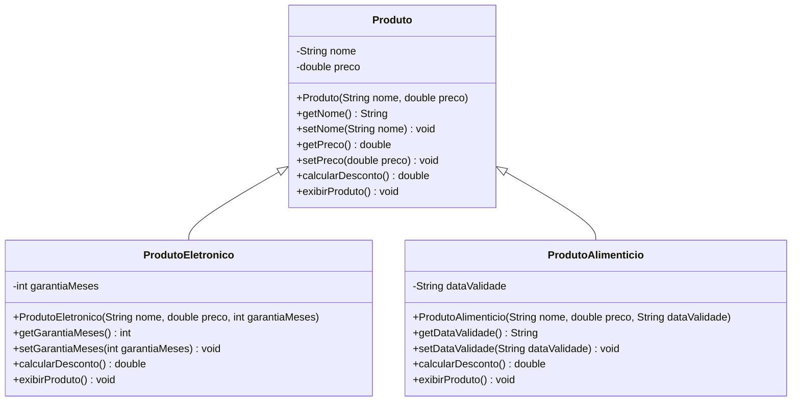

# Diagrama de Classes UML — Atividade 4 (Sistema de Produtos)

```mermaid
classDiagram
    class Produto {
        -String nome
        -double preco
        +Produto(String nome, double preco)
        +getNome() String
        +setNome(String nome) void
        +getPreco() double
        +setPreco(double preco) void
        +calcularDesconto() double
        +exibirProduto() void
    }

    class ProdutoEletronico {
        -int garantiaMeses
        +ProdutoEletronico(String nome, double preco, int garantiaMeses)
        +getGarantiaMeses() int
        +setGarantiaMeses(int garantiaMeses) void
        +calcularDesconto() double
        +exibirProduto() void
    }

    class ProdutoAlimenticio {
        -String dataValidade
        +ProdutoAlimenticio(String nome, double preco, String dataValidade)
        +getDataValidade() String
        +setDataValidade(String dataValidade) void
        +calcularDesconto() double
        +exibirProduto() void
    }

    Produto <|-- ProdutoEletronico
    Produto <|-- ProdutoAlimenticio
```
