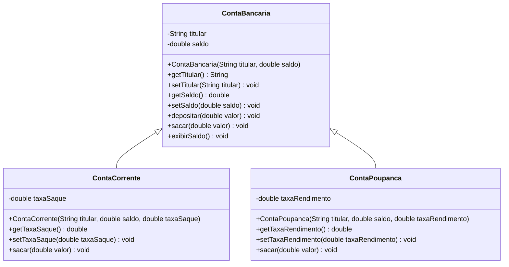

# Diagrama de Classes UML — Atividade 5 (Sistema Bancário)

```mermaid
classDiagram
    class ContaBancaria {
        -String titular
        -double saldo
        +ContaBancaria(String titular, double saldo)
        +getTitular() String
        +setTitular(String titular) void
        +getSaldo() double
        +setSaldo(double saldo) void
        +depositar(double valor) void
        +sacar(double valor) void
        +exibirSaldo() void
    }

    class ContaCorrente {
        -double taxaSaque
        +ContaCorrente(String titular, double saldo, double taxaSaque)
        +getTaxaSaque() double
        +setTaxaSaque(double taxaSaque) void
        +sacar(double valor) void
    }

    class ContaPoupanca {
        -double taxaRendimento
        +ContaPoupanca(String titular, double saldo, double taxaRendimento)
        +getTaxaRendimento() double
        +setTaxaRendimento(double taxaRendimento) void
        +sacar(double valor) void
    }

    ContaBancaria <|-- ContaCorrente
    ContaBancaria <|-- ContaPoupanca
```
