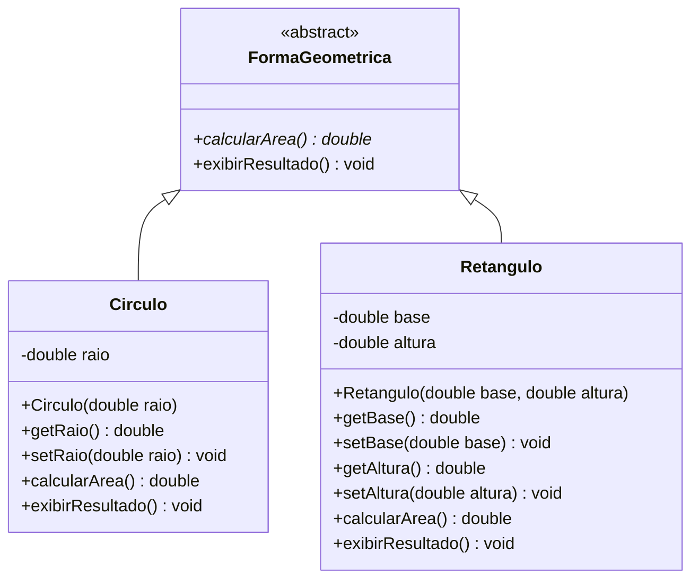

# Diagrama de Classes UML — Atividade 6 (Sistema de Formas Geométricas)

```mermaid
classDiagram
    class FormaGeometrica {
        <<abstract>>
        +calcularArea()* double
        +exibirResultado() void
    }

    class Circulo {
        -double raio
        +Circulo(double raio)
        +getRaio() double
        +setRaio(double raio) void
        +calcularArea() double
        +exibirResultado() void
    }

    class Retangulo {
        -double base
        -double altura
        +Retangulo(double base, double altura)
        +getBase() double
        +setBase(double base) void
        +getAltura() double
        +setAltura(double altura) void
        +calcularArea() double
        +exibirResultado() void
    }

    FormaGeometrica <|-- Circulo
    FormaGeometrica <|-- Retangulo
```
