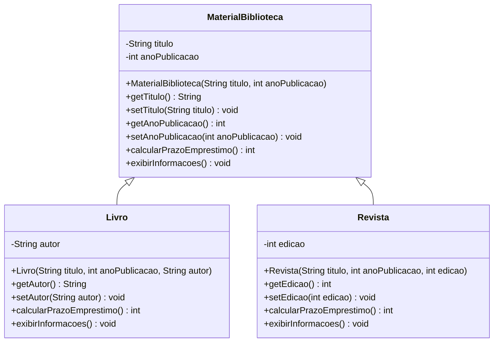

# Diagrama de Classes UML — Atividade 7 (Sistema de Biblioteca)

```mermaid
classDiagram
    class MaterialBiblioteca {
        -String titulo
        -int anoPublicacao
        +MaterialBiblioteca(String titulo, int anoPublicacao)
        +getTitulo() String
        +setTitulo(String titulo) void
        +getAnoPublicacao() int
        +setAnoPublicacao(int anoPublicacao) void
        +calcularPrazoEmprestimo() int
        +exibirInformacoes() void
    }

    class Livro {
        -String autor
        +Livro(String titulo, int anoPublicacao, String autor)
        +getAutor() String
        +setAutor(String autor) void
        +calcularPrazoEmprestimo() int
        +exibirInformacoes() void
    }

    class Revista {
        -int edicao
        +Revista(String titulo, int anoPublicacao, int edicao)
        +getEdicao() int
        +setEdicao(int edicao) void
        +calcularPrazoEmprestimo() int
        +exibirInformacoes() void
    }

    MaterialBiblioteca <|-- Livro
    MaterialBiblioteca <|-- Revista
```
