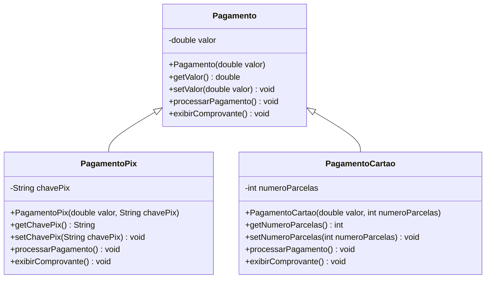

# Diagrama de Classes UML — Atividade 8 (Sistema de Pagamentos)

```mermaid
classDiagram
    class Pagamento {
        -double valor
        +Pagamento(double valor)
        +getValor() double
        +setValor(double valor) void
        +processarPagamento() void
        +exibirComprovante() void
    }

    class PagamentoPix {
        -String chavePix
        +PagamentoPix(double valor, String chavePix)
        +getChavePix() String
        +setChavePix(String chavePix) void
        +processarPagamento() void
        +exibirComprovante() void
    }

    class PagamentoCartao {
        -int numeroParcelas
        +PagamentoCartao(double valor, int numeroParcelas)
        +getNumeroParcelas() int
        +setNumeroParcelas(int numeroParcelas) void
        +processarPagamento() void
        +exibirComprovante() void
    }

    Pagamento <|-- PagamentoPix
    Pagamento <|-- PagamentoCartao
```
