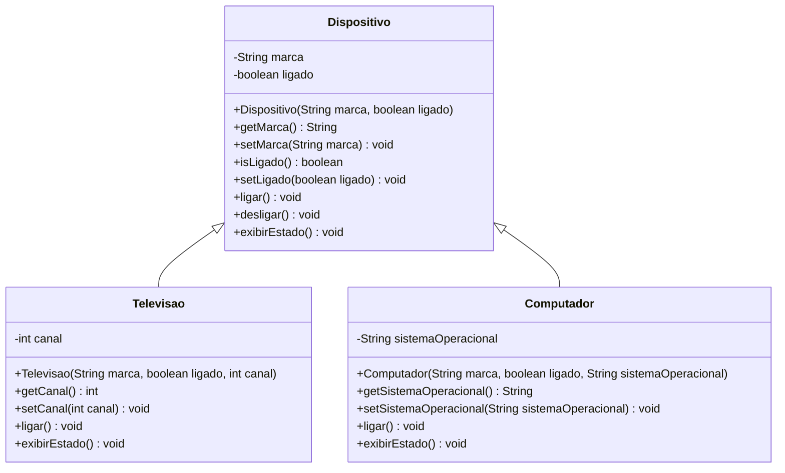

# Diagrama de Classes UML — Atividade 9 (Sistema de Dispositivos Eletrônicos)

```mermaid
classDiagram
    class Dispositivo {
        -String marca
        -boolean ligado
        +Dispositivo(String marca, boolean ligado)
        +getMarca() String
        +setMarca(String marca) void
        +isLigado() boolean
        +setLigado(boolean ligado) void
        +ligar() void
        +desligar() void
        +exibirEstado() void
    }

    class Televisao {
        -int canal
        +Televisao(String marca, boolean ligado, int canal)
        +getCanal() int
        +setCanal(int canal) void
        +ligar() void
        +exibirEstado() void
    }

    class Computador {
        -String sistemaOperacional
        +Computador(String marca, boolean ligado, String sistemaOperacional)
        +getSistemaOperacional() String
        +setSistemaOperacional(String sistemaOperacional) void
        +ligar() void
        +exibirEstado() void
    }

    Dispositivo <|-- Televisao
    Dispositivo <|-- Computador
```
