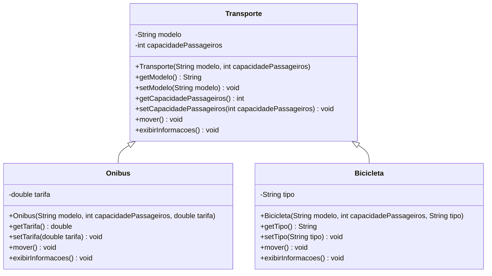

# Diagrama de Classes UML — Atividade 10 (Sistema de Transporte)

```mermaid
classDiagram
    class Transporte {
        -String modelo
        -int capacidadePassageiros
        +Transporte(String modelo, int capacidadePassageiros)
        +getModelo() String
        +setModelo(String modelo) void
        +getCapacidadePassageiros() int
        +setCapacidadePassageiros(int capacidadePassageiros) void
        +mover() void
        +exibirInformacoes() void
    }

    class Onibus {
        -double tarifa
        +Onibus(String modelo, int capacidadePassageiros, double tarifa)
        +getTarifa() double
        +setTarifa(double tarifa) void
        +mover() void
        +exibirInformacoes() void
    }

    class Bicicleta {
        -String tipo
        +Bicicleta(String modelo, int capacidadePassageiros, String tipo)
        +getTipo() String
        +setTipo(String tipo) void
        +mover() void
        +exibirInformacoes() void
    }

    Transporte <|-- Onibus
    Transporte <|-- Bicicleta
```
